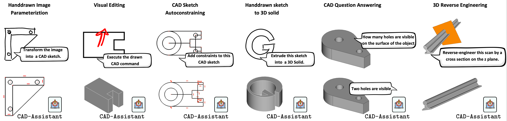

<span style="font-size:1.5em;"> <b>CAD-Assistant: Tool-Augmented VLLMs as Generic CAD Task Solvers</b></span> 
--

### [Dimitrios Mallis](https://dimitrismallis.github.io/), [Ahmet Serdar Karadeniz](https://askaradeniz.github.io/), [Sebastian Cavada](https://sebo-the-tramp.github.io/), [Danila Rukhovich](https://www.uni.lu/snt-en/people/danila-rukhovich/), [Niki Foteinopoulou](https://nickyfot.github.io/), [Kseniya Cherenkova](https://www.linkedin.com/in/kseniya-cherenkova-a3a65a54/), [Anis Kacem](https://www.uni.lu/en/person/NTAwMzU1NDVfX0FuaXMgS0FDRU0=/), [Djamila Aouada](https://www.uni.lu/snt-en/people/djamila-aouada/)

This repository will contain the official codebase for our ICCV 2025 paper.

📄 [CAD-Assistant Paper](https://arxiv.org/abs/2412.13810) |
🌐 [CAD-Assistant Project Page](https://cadassistant.github.io/)


## 🚀 Overview


CAD-Assistant is a tool-augmented VLLM framework for AI-assisted CAD. Our framework generates [FreeCAD](https://freecad-python-stubs.readthedocs.io/en/latest/autoapi/FreeCAD/index.html) code that is executed within CAD software directly. CAD-Assistant can process multimodal inputs, including textual queries, sketches, drawn commands and 3D scans.

<p align="center">
  
</p>


Current release includes the CAD-Assistant framework implementation intergrated with FreeCAD and augmented with a 2D CAD sketch renderering tool.Evaluation is performed on the 2D partition of the SGP-Bench. The code also allows for easy intergration of novel tools. More CAD-tool implementations and evaluation settings will be released.


## 🛠️ Installation

### Configuration

Edit `config.json` and add your OpenAI API key:
```json
  "openai_api_key": "your-openai-api-key-here",
```

### Docker Installation

The easiest way to get started is using Docker, which includes all dependencies including FreeCAD:

1. **Clone the repository**
   ```bash
   git clone <your-repo-url>
   cd CAD-Assistant
   ```

2. **Build and run with Docker**
   ```bash
   docker build -t cad-assistant .
   docker run -it -v $(pwd):/app cad-assistant
   ```


## 🎯 Evaluation for 2D CAD Question Answering

This repository includes evaluation on the 2D partition of the [SGP-bench](https://sgp-bench.github.io/) dataset. We provide preprocessed SGP-bench test samples in the `sgp_bench_samples/` directory, were CAD sketches are preloaded to FreeCAD `.FCStd` files. The directory includes the 700 FreeCAD `.FCStd` test sketch files organized directories (`2D_0001/`, `2D_0002/`, etc.)


#### Quick Test (5 samples, sequential)
```bash
python run_cad_evaluation.py --limit 5 --debug
```

#### Full Evaluation (all samples, parallel)
```bash
python run_cad_evaluation.py --parallel --workers 4
```

After running evaluation, a JSON results file will appear in the root directory and intermediate logs per sample will be saved in the `.logs/` folder.

## 🔧 CAD-Specific Tools

### The `sketch_recognizer` tool

Current release includes the 2D CAD sketch renderering tool `sketch_recognizer`. The code implementation of the `sketch_recognizer` is adapted from [Vitruvion](https://github.com/PrincetonLIPS/vitruvion/tree/main/sketchgraphs).

*Is Construction Flag*: The sketch rendering function loads construction information from `2D_****_isconstruction.json` since FreeCAD doesn't support an _is construction flag_ stored in the `.FCStd` file format.


### Extending CAD-Assistant with New Tools and FreeCAD Commands

The CAD-Assistant framework is easily extendable with new tools and FreeCAD functions.

**Adding New Tools**:
To add custom tools to the CAD-Assistant framework:

1. **Create your tool**: Add both the tool code (`[cad-tool-name]_code.py`) and tool documentation (`cad-tool_doc.txt`) in the `cad_assistant/tools/` directory.
2. **Register the tool**: Add your tool to the tool registry in `config.json`


**Adding New FreeCAD Commands**:
To extend the available FreeCAD commands simply extend the `cad_assistant/prompts/freecad_doc.j2` file with your new FreeCAD command documentation

## 🛡️ License

This project is licensed under an Attribution-NonCommercial License.

## 📑 Citation
If you find this work useful for your research, please cite our paper:
```
@article{Mallis2024CADAssistantTV,
        title={CAD-Assistant: Tool-Augmented VLLMs as Generic CAD Task Solvers},
        author={Dimitrios Mallis and Ahmet Serdar Karadeniz and Sebastian Cavada and Danila Rukhovich and Niki Maria Foteinopoulou and Kseniya Cherenkova and Anis Kacem and Djamila Aouada},
        journal={ArXiv},
        year={2024},
        volume={abs/2412.13810},
      }
```


